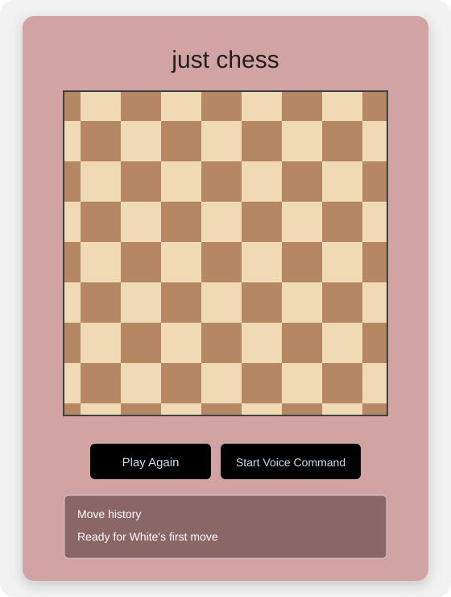
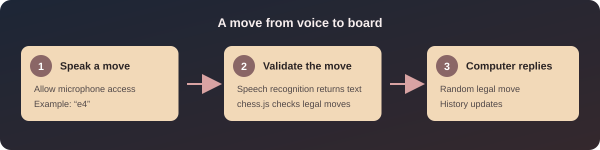

# Just Chess

A small, browser-based chess game with mouse and voice input. Play as White against a computer opponent that responds with a random legal move. The board, pieces, and move history are displayed on one page.



## Features

- Interactive 8 × 8 board with draggable pieces
- Play as White; the computer makes a random legal reply after each move
- Optional voice input using the browser's Web Speech API, with the recognized transcript and move legality shown on screen
- Move history for the current game
- **Play Again** button to reset the board and history
- Moves that require promotion default to a queen

## How to play

1. Open `index.html` in a modern browser. The page loads jQuery and chess.js from CDNs, so an internet connection is needed.
2. You play White. Move a piece by dragging it to a legal square, or use voice input as described below.
3. After a legal White move, wait for the computer to make its random legal reply before making your next move.
4. The move history appears below the board. Select **Play Again** whenever you want to reset the board and history.

## Voice command guide

Select **Start Voice Command**, allow microphone access, then say a piece-and-destination command. You can use the full piece name, a piece letter with “to,” or a compact piece letter and square. The app displays what the browser recognized and whether chess.js accepted the move as legal in the current position. Standard chess notation is also supported. Speech recognition can vary, so compare the displayed transcript with what you said.

The examples below show standard notation. Each move is only an example: it must be legal in the current position.

| Piece | Voice move examples | What the notation means |
| --- | --- | --- |
| Piece | Full-name command | Letter command | Compact command |
| --- | --- | --- | --- |
| Pawn | “move pawn to e four” | “move p to e four” | `pe4` |
| Knight | “move knight to f three” | “move n to f three” | `nf3` |
| Bishop | “move bishop to c four” | “move b to c four” | `bc4` |
| Rook | “move rook to a three” | “move r to a three” | `ra3` |
| Queen | “move queen to h five” | “move q to h five” | `qh5` |
| King | “move king to e two” | “move k to e two” | `ke2` |
| Castling | Use standard notation: `O-O` or `O-O-O` | — | — |

To call out a capture explicitly, say “[piece] capture [target square],” optionally using “to” or “on” before the square. For example, “pawn capture d five,” “move p capture on d five,” or “knight capture to f three.” This explicit capture form is supported for every piece:

| Piece | Capture command example |
| --- | --- |
| Pawn | “pawn capture d five” |
| Knight | “knight capture d five” |
| Bishop | “bishop capture d five” |
| Rook | “rook capture d five” |
| Queen | “queen capture d five” |
| King | “king capture d five” |

The target square is only an example; the capture must be legal in the current position. An explicit capture command is rejected if that piece cannot legally capture on the named square. You can also capture using the regular “move [piece] to [square]” command: when an opponent’s piece occupies the destination, a legal move there captures it. Standard chess capture notation such as `Nxd5` and `exd5` remains supported.

Say the destination file (`a` through `h`) followed by its rank (`one` through `eight`), for example “move p to e four.” Letter commands accept the piece letter with or without “move” and “to”; compact commands use the piece letter followed immediately by the square. `P` is accepted as the pawn letter. If more than one piece of that type can reach the destination, use standard chess notation or drag the piece instead. For special moves, standard notation is also supported: `x` marks a capture, `+` check, and `#` checkmate (for example `Bxf7+`); castling uses `O-O` or `O-O-O`. Pawn promotion notation such as `e8=Q` is supported, and promotions default to a queen.

### Voice-input steps

1. Use a supported browser such as Chrome or Edge, and open the page from `localhost` or a secure (`https:`) origin if required for microphone access.
2. Select **Start Voice Command** and grant microphone permission.
3. When prompted, say a piece-and-destination command, for example “move pawn to e four,” “move p to e four,” or “pe4.” The compact form may be recognized as separate spoken characters, for example “p e four.” You can also say standard notation such as `e4` or `Nf3`.
4. Read the status message below the buttons: it shows the recognized words and whether the move is legal. If legal, the board and move history update; if not, try again with valid notation.
5. Repeat on White’s turn. If a move is rejected or ambiguous, try standard notation or drag the piece instead.



Voice input requires a browser that supports the Web Speech API and microphone permission. Mouse play works without microphone access.

## Tech stack

- HTML, CSS, and vanilla JavaScript
- [Chessboard.js](https://chessboardjs.com/) for the board UI
- [chess.js](https://github.com/jhlywa/chess.js) for legal move validation
- Browser Web Speech API for voice recognition
- jQuery and chess.js are loaded from CDNs; Chessboard.js, its stylesheet, and piece images are included in this repository

## Project structure

```text
voice-enabled-chess/
├── index.html
├── style.css
├── script.js
├── css/
│   └── chessboard-1.0.0.min.css
├── js/
│   └── chessboard-1.0.0.min.js
├── img/
│   ├── chesspieces/wikipedia/   # Chessboard piece images
│   ├── readme-game-preview.svg
│   └── readme-voice-flow.svg
└── README.md
```

There is no build step. Open `index.html` directly to play, or serve the project root from a local web server if your browser requires a secure origin for microphone access.

## Ideas for future improvements

- More flexible voice-command parsing and clearer invalid-move feedback
- Human-vs-human mode or a stronger chess engine
- Improved mobile layout, accessibility, and animations

## Author

Harsh241104
